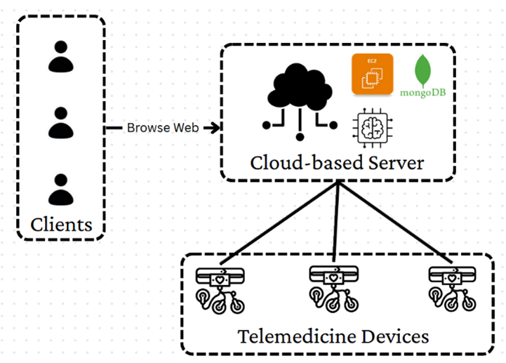
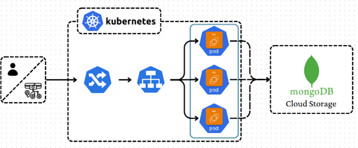
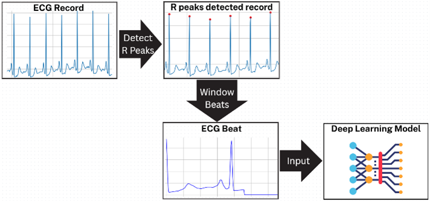
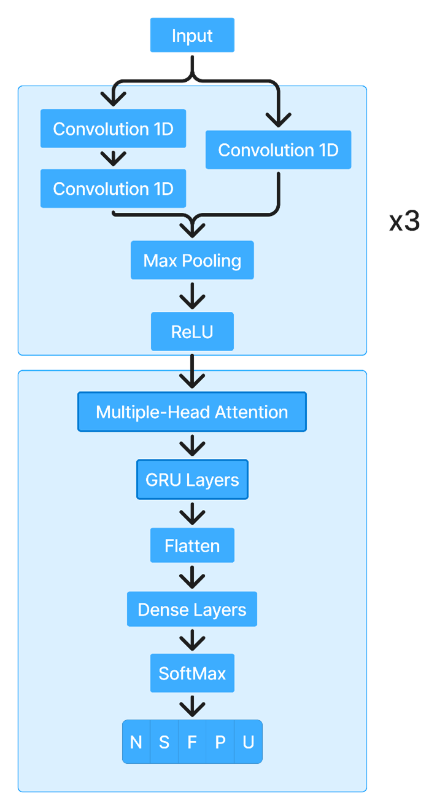

# A Cloud-Enabled Autonomous Telemedicine Platform for Continuous ECG Monitoring and Arrhythmia Classification

This repository contains the implementation of an integrated telemedicine solution that bridges the gap between hardware biosignal acquisition and cloud-based deep learning diagnostics.

## Project Overview

The system provides a scalable framework for continuous ECG monitoring, utilizing a custom wearable device and a cloud-native backend to perform real-time arrhythmia classification.

### Key Features
* **Wearable IoT Hardware:** Custom 4cm x 4cm device integrating an ESP8266 MCU and AD8232 front-end for Lead II ECG acquisition.
* **Cloud Infrastructure:** Orchestrated by Kubernetes on AWS EC2 instances for elastic resource provisioning and high availability.
* **Hybrid Deep Learning:** A CNN-GRU-Attention model achieving 99.0% accuracy across five heartbeat classes.
* **Real-time Visualization:** Web-based dashboard for secure patient data management and immediate diagnostic feedback.

---

## System Architecture

The architecture is designed to offload computationally intensive AI tasks from low-power edge devices to a centralized cloud environment.

### 1. High-Level Telemedicine Framework
The system connects wearable devices directly to a cloud-based server via Wi-Fi (HTTP/REST), removing the need for an intermediate PC or base station.

### 2. Cloud Microservices & Orchestration
Utilizing Kubernetes, the system manages independent server pods that handle signal processing, inference, and storage in a document-oriented MongoDB database.

---

## Deep Learning & Signal Processing

### Preprocessing Pipeline
To preserve essential PQRST morphological features, raw signals (sampled at 150Hz) undergo normalization, R-peak detection, and segmentation into 187-sample beats.

### Model Architecture
The hybrid model fuses deep and shallow features through cascaded and parallel 1D-Convolutional layers, followed by Multi-Head Attention to capture distinct temporal perspectives.

**Performance Summary (MIT-BIH Test Set):**
| Metric | Result |
| :--- | :--- |
| **Accuracy** | 99.0% |
| **Precision** | 93.6% |
| **Recall** | 90.8% |
| **F1-Score** | 92.0% |

---

## Requirements & Installation

### Hardware
* ESP8266 Microcontroller 
* AD8232 ECG Analog Front-End 
* SD Card Module for local backup 

### Software (Cloud/Inference)
* **Backend:** Python (FastAPI/Flask), MongoDB 
* **AI Framework:** PyTorch, scikit-learn 
* **Infrastructure:** Docker, Kubernetes 

---
